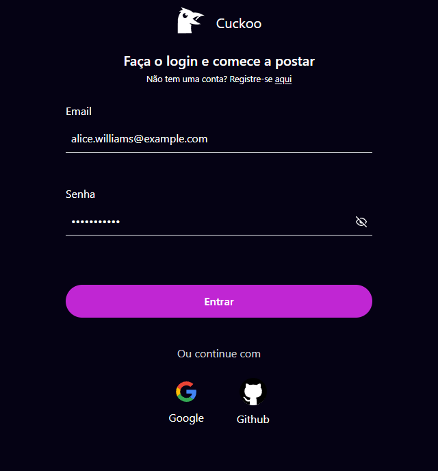
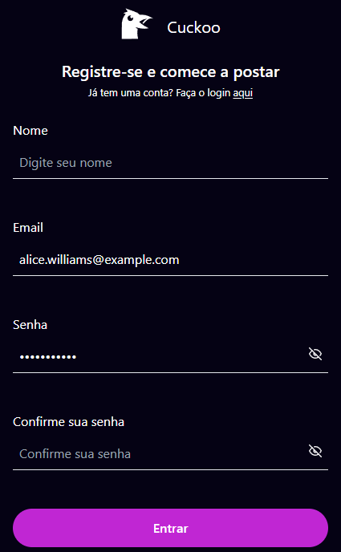
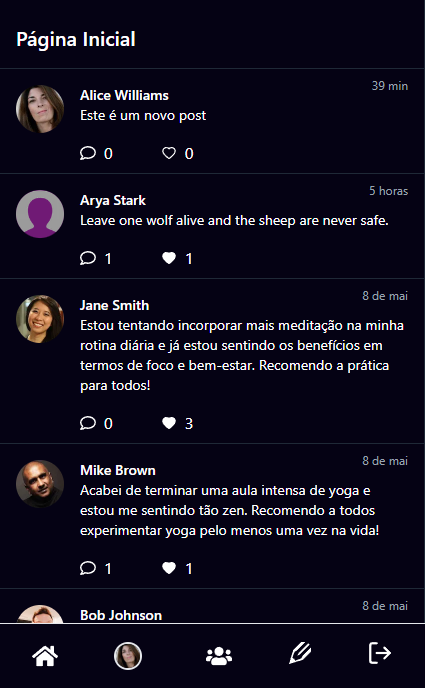
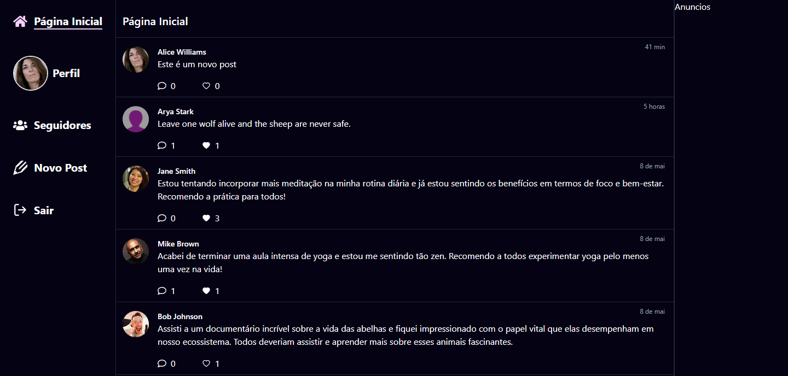
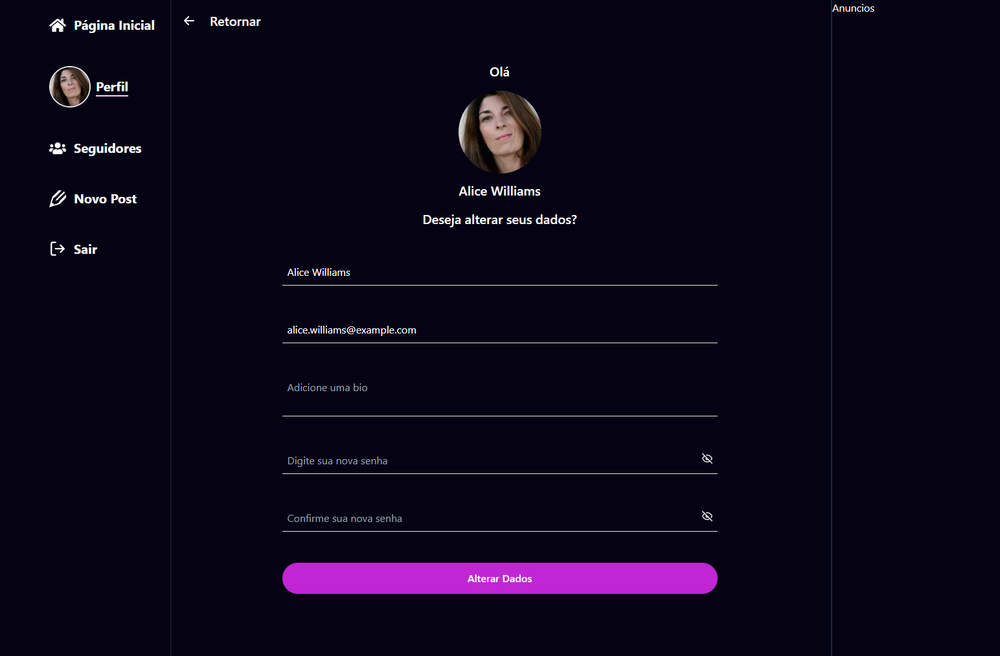
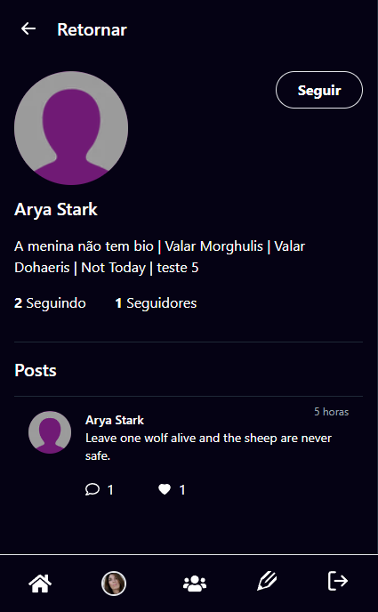
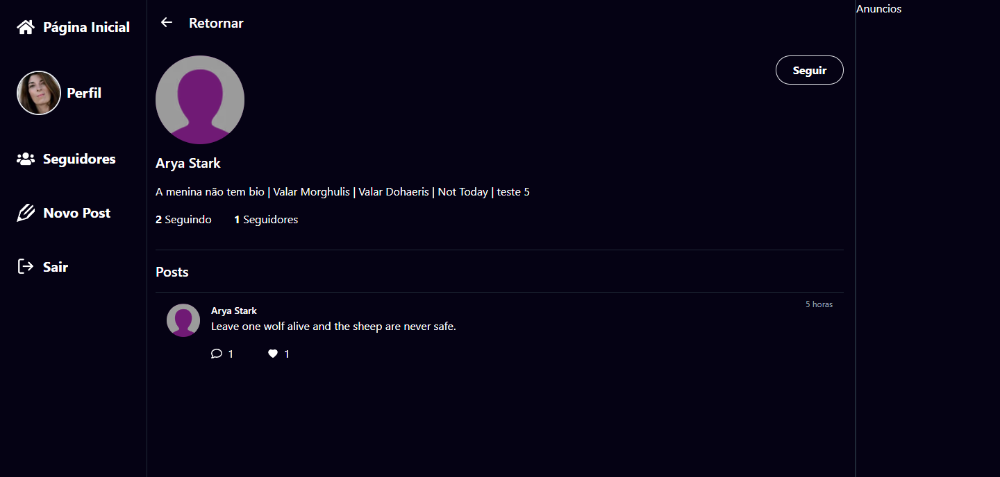
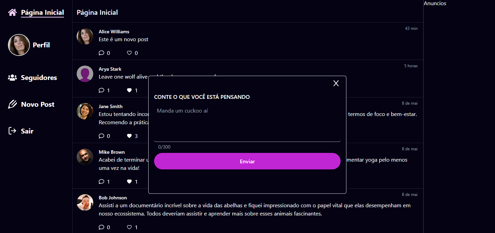
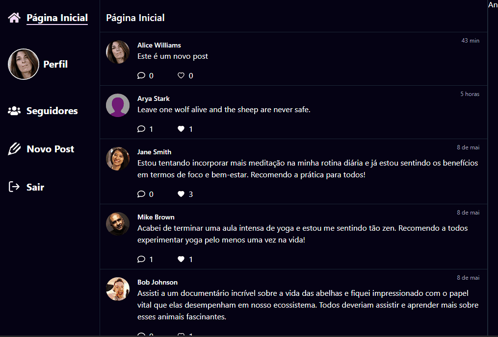

# Cuckoo

[English Version](./README_EN.md)


O Cuckoo é uma rede social similar ao Twitter, onde os usuários podem postar, comentar e curtir os posts e também podem seguir outros usuários e receber atualizações em seu feed de notícias.

## Tecnologias Utilizadas

O projeto foi desenvolvido utilizando a linguagem de programação TypeScript com o framework Next.js. Para o banco de dados, foi utilizado o Prisma em conjunto com o PostgreSQL. A autenticação é feita através do NextAuth, permitindo que os usuários se cadastrem e façam login usando redes sociais ou suas próprias credenciais de email e senha.

## Funcionalidades

- Postagem de mensagens
- Comentários em postagens
- Curtidas em postagens
- Seguindo outros usuários
- Feed de notícias
- Autenticação de usuários

## Instalação

Para executar o projeto, é necessário ter o Node.js instalado em sua máquina. Clone o repositório e, em seguida, instale as dependências do projeto com o seguinte comando:

```bash
yarn
```

Em seguida, crie um arquivo `.env` e configure suas variáveis de ambiente para se conectarem ao seu banco de dados. Por fim, execute o seguinte comando para iniciar o servidor:

```bash
yarn dev
```

O projeto será executado em `http://localhost:3000`.

## Contribuindo

Sinta-se à vontade para contribuir com este projeto. Para fazer isso, faça um fork do repositório e crie uma nova branch para suas alterações. Depois de fazer suas alterações, crie um pull request para que possamos revisá-las.

## Acessibilidade

Este projeto foi desenvolvido com atenção especial para a acessibilidade. Foram utilizadas tags semânticas e atributos ARIA para tornar o aplicativo o mais acessível possível para todos os usuários.

## Responsividade

A versão web do aplicativo é totalmente responsiva, o que significa que ela se adaptará a diferentes tamanhos de tela, desde dispositivos móveis até desktops.

## Telas da Aplicação

### Login

**Mobile**



**Desktop**


### Cadastro

**Mobile**



**Desktop**


### Tela Principal

**Mobile**



**Tablet**


**Desktop**



### Tela de Editar Perfil



### Seguidores


### Tela do Perfil de usuários

**Mobile**



**Tablet**


**Desktop**



### Post Modal



**Desktop Animation**



**Mobile Animation**


## Licença

Este projeto é licenciado sob a Licença MIT - consulte o arquivo LICENSE.md para obter mais detalhes.
