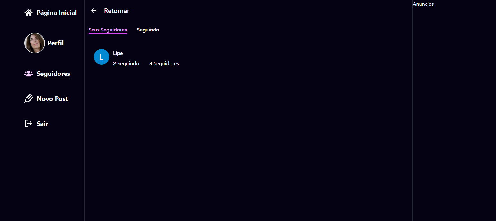

# Cuckoo

[PTBR Version](./README.md)


Cuckoo is a social network similar to Twitter, where users can post, comment, and like other users' posts. Users can also follow other users and receive updates on their newsfeed.

## Technologies Used

The project was developed using the TypeScript programming language with the Next.js framework. For the database, Prisma was used in conjunction with PostgreSQL. Authentication is done through NextAuth, allowing users to register and log in using social networks or their own email and password credentials.

## Features

- Post messages
- Comments on posts
- Likes on posts
- Following other users
- Newsfeed
- User authentication

## Installation

To run the project, you must have Node.js installed on your machine. Clone the repository and then install the project dependencies with the following command:

```bash
yarn
```

Next, create a .env file and configure your environment variables to connect to your database. Finally, run the following command to start the server:

```bash
yarn dev
```

The project will be running at  `http://localhost:3000`.

## Contributing

Feel free to contribute to this project. To do so, fork the repository and create a new branch for your changes. After making your changes, create a pull request so we can review them.

## Accessibility

This project was developed with special attention to accessibility. Semantic tags and ARIA attributes were used to make the application as accessible as possible for all users.

## Responsiveness

The web version of the application is fully responsive, which means it will adapt to different screen sizes, from mobile devices to desktops.

## Screenshots

### Login

**Mobile**


**Desktop**


### Registration

**Mobile**


**Desktop**


### Main Screen

**Mobile**


**Tablet**


**Desktop**


### Edit Profile


### Followers



### User Profile

**Mobile**


**Tablet**


**Desktop**


### Post Modal


**Desktop Animation**


**Mobile Animation**


## License

This project is under MIT license, check the LICENSE.md file for more details
